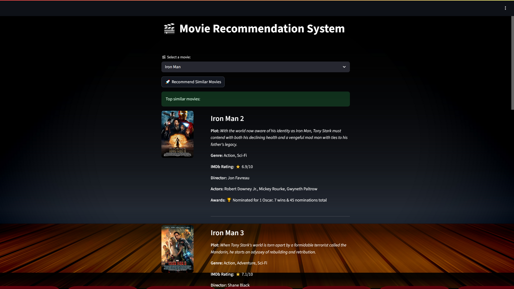

# 🎬 Movie Recommendation System


An NLP-powered movie recommendation system that suggests similar movies using machine learning and provides detailed movie information with posters and ratings.



**[Live Demo - Try it here!](https://movie-recommendation-system-usbi.onrender.com)**

## What This Project Does

Love a movie and want to find similar ones? This app helps you discover your next favorite film!

Simply select any movie and instantly get **5 personalized recommendations** with detailed information including plots, ratings, cast, and movie posters.

Perfect for:

- Finding movies similar to your favorites
- Discovering new films to watch
- Learning about movie recommendation algorithms
- Exploring movie databases and APIs


## How It Works

**Simply select a movie:**

- Choose from 1,500+ movies in the dropdown
- Click "Recommend Similar Movies"
- Get instant AI-powered suggestions
- See movie posters, plots, ratings, and cast details
- All information fetched in real-time from OMDB API


## Key Features

- **NLP-Powered Recommendations** - Uses TF-IDF and cosine similarity for accurate suggestions
- **Rich Movie Information** - Posters, plots, IMDb ratings, cast, and director details
- **Real-time Data** - Fresh movie information from OMDB API
- **4,500+ Movies** - Large database of popular films
- **Instant Results** - Get recommendations in under 2 seconds
- **Mobile Friendly** - Works perfectly on all devices
- **No Registration** - Start using immediately


## The Machine Learning Model

**How it works:**

- **Content-Based Filtering** - Analyzes movie genres, keywords, overview, and taglines
- **TF-IDF Vectorization** - Converts text into numerical features (2,000 features)
- **Cosine Similarity** - Finds movies with similar content patterns
- **Smart Matching** - Considers plot elements, genres, and movie themes

**What it analyzes:**

- Movie genres (Action, Comedy, Drama, etc.)
- Plot keywords and themes
- Movie overviews and descriptions
- Taglines and promotional text

**Performance:**

- **4,500 movies** processed and analyzed
- **2,000+ TF-IDF features** for comprehensive text analysis
- **Instant similarity calculations** using optimized algorithms


## Technologies Used

- **Python** - Core programming language
- **Scikit-learn** - TF-IDF vectorization and cosine similarity
- **Streamlit** - Interactive web application framework
- **NLTK** - Text preprocessing and tokenization
- **OMDB API** - Real-time movie data and posters
- **Pandas \& NumPy** - Data manipulation and analysis
- **Hugging Face** - Model storage and deployment
- **Render** - Cloud hosting platform


## Project Structure

```
Movie-Recommendation-System/
├── app.py                      # Main Streamlit web application
├── recommend.py                # Core recommendation engine
├── omdb_utils.py              # OMDB API integration
├── preprocess.py              # Data preprocessing pipeline
├── requirements.txt           # Python dependencies
├── original_movies_data.csv   # Movie dataset
├── config_template.json       # API key template
├── .gitignore                 # Security and cleanup
└── README.md                  # Project documentation
```


## Model Development Process

**1. Data Preprocessing**

- Started with 4,800+ movie records
- Cleaned and processed to 1,500 high-quality entries
- Combined genres, keywords, overviews, and taglines for analysis

**2. Feature Engineering**

- Applied TF-IDF vectorization for text analysis
- Created 2,000-dimensional feature space
- Optimized for content-based similarity matching

**3. Similarity Calculation**

- Computed cosine similarity between all movies
- Built similarity matrix for instant recommendations
- Optimized for fast real-time predictions

**4. API Integration**

- Connected with OMDB API for real-time movie data
- Added poster images, ratings, and cast information
- Implemented fallback handling for missing data


## How to Run Locally

1. **Clone the repository**
```bash
git clone https://github.com/sankaran-s2001/Movie-Recommendation-System.git
cd movie-recommendation-system
```

2. **Install dependencies**
```bash
pip install -r requirements.txt
```

3. **Setup API key**

- Get free API key from [OMDB API](http://www.omdbapi.com/apikey.aspx)
- Copy `config_template.json` to `config.json`
- Add your API key to `config.json`

4. **Run preprocessing** (first time only)
```bash
python preprocess.py
```

5. **Start the application**
```bash
streamlit run app.py
```

6. **Open in browser** - Navigate to `http://localhost:8501`

## Real-World Applications

**Simple Use Cases:**

- **Movie Night Planning** - Find films similar to your favorites
- **Discovery Tool** - Explore new movies in your preferred style
- **Learning Project** - Understand how recommendation systems work
- **Entertainment** - Browse and discover movies with rich details

**Examples:**

- Select "Iron Man" → Get "Iron Man 2", "Avengers", "X-Men" recommendations
- Choose "The Dark Knight" → Discover similar superhero and thriller movies
- Pick "Titanic" → Find romantic dramas with similar themes


## What I Learned Building This

**Technical Skills:**

- **Machine Learning** - Content-based recommendation algorithms
- **Text Processing** - TF-IDF vectorization and similarity calculations
- **API Integration** - Real-time data fetching from external services
- **Web Development** - Building interactive applications with Streamlit
- **Cloud Deployment** - Model storage on Hugging Face and hosting on Render

**Data Science Skills:**

- **Feature Engineering** - Combining multiple text fields for better recommendations
- **Model Optimization** - Memory-efficient processing for cloud deployment
- **Data Pipeline** - End-to-end system from raw data to web application
- **Performance Tuning** - Optimizing for fast response times

**Problem-Solving Skills:**

- **Memory Management** - Solved deployment memory issues with smart model storage
- **API Design** - Created clean interfaces between different system components
- **User Experience** - Designed intuitive interface for movie selection and results


## Technical Achievements

- **Efficient Algorithm** - Fast similarity calculations for 1,500+ movies
- **Cloud Deployment** - Successfully deployed with Hugging Face model storage
- **Real-time Integration** - Live movie data with posters and details
- **Memory Optimization** - Solved deployment constraints with smart architecture
- **Professional UI** - Clean, responsive interface with rich movie information


## Architecture Highlights

**Smart Model Storage:**

- Models stored on Hugging Face for efficient deployment
- Automatic download and caching on first use
- Eliminates memory issues during preprocessing

**API Integration:**

- Real-time movie data from OMDB API
- Robust error handling for missing information
- Rich content display with posters and metadata


## Future Improvements

- Add user rating and review integration
- Implement collaborative filtering for personalized recommendations
- Include movie trailers and streaming platform availability
- Add recommendation explanation features
- Create user profiles for recommendation history
- Expand database to include TV shows and documentaries


## ✉️ Contact

**Sankaran S**  
[](https://github.com/sankaran-s2001)  
[](https://www.linkedin.com/in/sankaran-s21/)  
[](mailto:sankaran121101@gmail.com)

*This project demonstrates how machine learning can power intelligent recommendation systems. Built to showcase data science skills and create a practical tool for movie discovery.*

⭐ **If you find this project helpful, please star it!**

